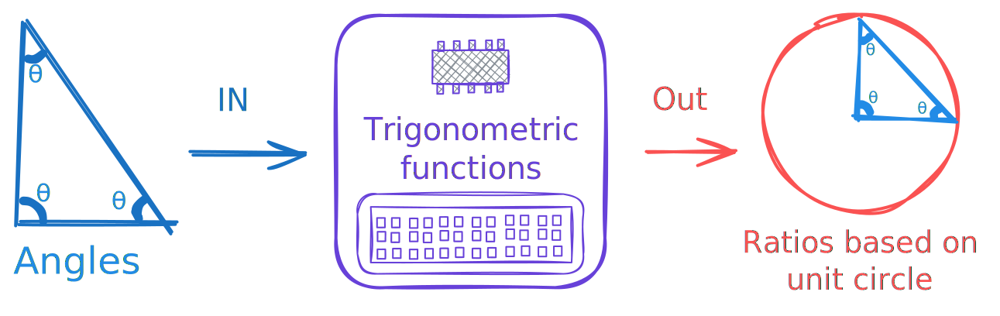
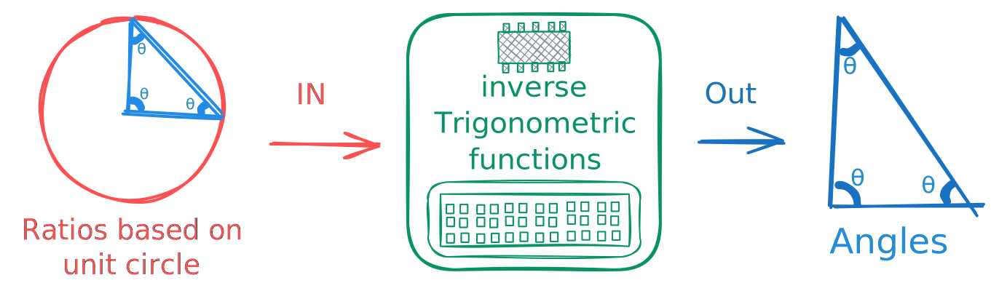

## Unit Circle
unit circle is a circle that has radius which is $$1$$ one.

## Trigonometric functions
Trigonometric functions takes angle as input and produce ratio as output based on relationships within a right-angled triangle on unit circle.

## inverse functions
inverse Trigonometric functions reverse the operation of the standard trigonometric functions
